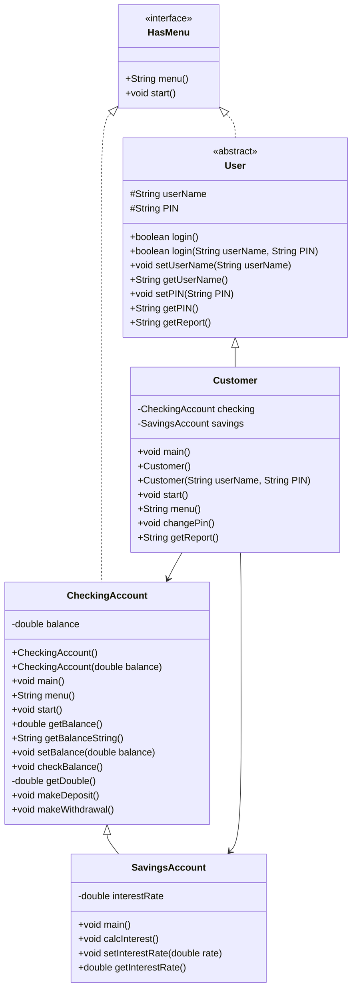

# Bank on It Part 1

**Name:** Steven Houser  
**Course:** CS 121 - Data Structures & Objects  
**Date:** 03/20/26

---

## UML Diagram

---

## Program Description

A small ATM-style banking system. Customers can log in and manage a checking account and a savings account. The system is organized using a `HasMenu` interface, inheritance between account classes, and an abstract `User` class shared by all user types.

---

## Algorithm

**Goal:** Build a multi-class banking system where a customer can log in, deposit, withdraw, check balances, and change their PIN across checking and savings accounts.

---

### HasMenu interface

**Goal:** Define a contract that any class with a menu must fulfill.

`menu()`
- Declare method signature: returns String, no parameters

`start()`
- Declare method signature: returns void, no parameters

---

### CheckingAccount class

**Goal:** Manage a single balance with deposit, withdrawal, and balance check operations through a menu loop.

**Variables needed:**

- `balance` - the account balance (double)

`CheckingAccount()`
- Set balance to 0D

`CheckingAccount(double balance)`
- Set this.balance to the given balance

`main()`
- Create a new CheckingAccount
- Call start()

`menu()`
- Create a local Scanner
- Print blank line, "Account menu", blank line
- Print 0) Quit, 1) Check balance, 2) Make a deposit, 3) Make a withdrawal
- Print blank line and prompt "Please enter 0-3: "
- Read response with nextLine()
- Return response

`start()`
- Set keepGoing to true
- While keepGoing is true:
    - Call menu(), store result in response
    - If response equals "0": set keepGoing to false
    - Else if "1": call checkBalance()
    - Else if "2": call makeDeposit()
    - Else if "3": call makeWithdrawal()
    - Else: print invalid input message

`getBalance()`
- Return this.balance

`getBalanceString()`
- Return String.format("$%.2f", this.balance)

`setBalance(double balance)`
- Set this.balance to balance

`checkBalance()`
- Print "Checking balance..."
- Print "Current balance: " + getBalanceString()

`getDouble()` (private)
- Create a local Scanner
- Read next line as String
- Try to parse with Double.parseDouble()
- If NumberFormatException: print warning, return 0D
- Otherwise return the parsed amount

`makeDeposit()`
- Print "Making a deposit..."
- Prompt "How much to deposit? "
- Call getDouble(), store as amount
- Add amount to balance
- Print "New balance: " + getBalanceString()

`makeWithdrawal()`
- Print "Making a withdrawal..."
- Prompt "How much to withdraw? "
- Call getDouble(), store as amount
- If amount <= 0: print "Amount must be greater than zero."
- Else if amount > balance: print "Insufficient funds."
- Else: subtract amount from balance, print "New balance: " + getBalanceString()

---

### SavingsAccount class

**Goal:** Extend CheckingAccount with an interest rate that can be applied to the balance.

**Variables needed:**

- `interestRate` - the interest rate, default 0.05 (double)

`main()`
- Create a new SavingsAccount
- Call start()

`setInterestRate(double interestRate)`
- Set this.interestRate to interestRate

`getInterestRate()`
- Return this.interestRate

`calcInterest()`
- Calculate interestAmount = balance * interestRate
- Add interestAmount to balance
- Print "Interest applied. New balance: " + getBalanceString()

---

### User abstract class

**Goal:** Provide shared login logic and credential storage for all user types.

**Variables needed:**

- `userName` - the account username (String)
- `PIN` - the account PIN, stored as String (String)

`getUserName()`
- Return this.userName

`setUserName(String userName)`
- Set this.userName to userName

`getPIN()`
- Return this.PIN

`setPIN(String PIN)`
- If PIN matches regex "^\d{4}$": set this.PIN to PIN
- Else: print invalid PIN warning, set this.PIN to "0000"

`login(String userNameIn, String pinIn)`
- If userNameIn does not equal this.userName: print "Incorrect username.", return false
- Else if pinIn does not equal this.PIN: print "Incorrect PIN.", return false
- Else: print "Login Successful", return true

`login()`
- Create a local Scanner
- Prompt "User name: ", read userNameIn with nextLine()
- Prompt "PIN: ", read pinIn with nextLine()
- Call and return login(userNameIn, pinIn)

`getReport()`
- Declared abstract — subclasses must implement

---

### Customer class

**Goal:** Extend User with checking and savings accounts, and provide a customer-facing menu to manage both.

**Variables needed:**

- `checking` - the customer's checking account (CheckingAccount)
- `savings` - the customer's savings account (SavingsAccount)
- `serialVersionUID` - serialization version identifier (long)

`main()`
- Create Customer c = new Customer()
- Call c.login(), store result in loggedIn
- If loggedIn is true: call c.start()

`Customer()`
- Set userName to "Alice"
- Set PIN to "0000"

`Customer(String userName, String PIN)`
- Set this.userName to userName
- Set this.PIN to PIN

`menu()`
- Create a local Scanner
- Print blank line, "Customer Menu", blank line
- Print 0) Exit, 1) Manage Checking Account, 2) Manage Savings Account, 3) Change PIN
- Print blank line and prompt "Action (0-3): "
- Read response with nextLine()
- Return response

`start()`
- Set keepGoing to true
- While keepGoing is true:
    - Call menu(), store result in response
    - If response equals "0": set keepGoing to false
    - Else if "1": print "Checking Account", call this.checking.start()
    - Else if "2": print "Savings Account", call this.savings.start()
    - Else if "3": call changePin()
    - Else: print invalid input message

`changePin()`
- Create a local Scanner
- Prompt "Enter new PIN: "
- Read new PIN with nextLine()
- Call setPIN() with the new PIN

`getReport()`
- Build and return a formatted string with userName, checking balance, and savings balance

---

## Blackbelt Extension

Three security improvements documented as going beyond the minimum:

1. **Negative withdrawal fix** - `makeWithdrawal()` rejects amounts <= 0 in addition to amounts exceeding the balance. The professor pointed out this loophole during the explainer and expected students to fix it.

2. **PIN format validation** - `setPIN()` uses a regular expression (`^\d{4}$`) to enforce that any PIN must be exactly four digits. If invalid, the PIN resets to `"0000"` and a warning is printed.

3. **Change PIN enforcement** - `changePin()` calls `setPIN()`, so the regex validation applies automatically to all PIN changes. No extra logic needed beyond connecting the two methods.

---

## Build Instructions

- **Build and test Customer:** `make testCustomer`
- **Build and test CheckingAccount:** `make testChecking`
- **Build and test SavingsAccount:** `make testSavings`
- **Clean:** `make clean`

